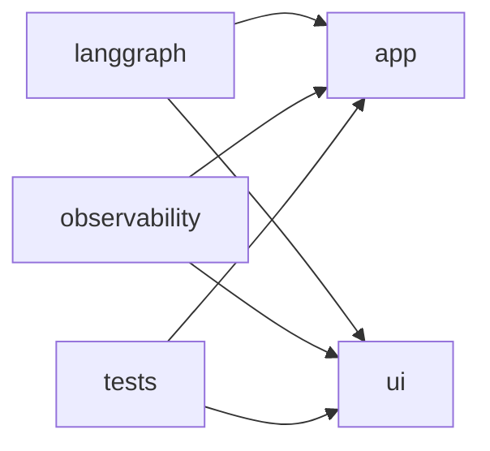
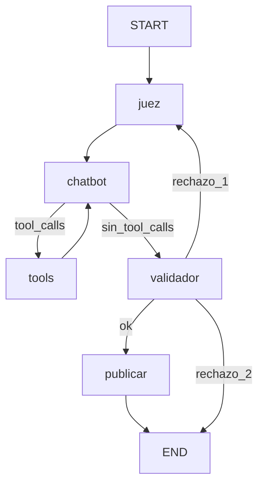

> Actualización S5/S6: el recorrido principal está en [material/README.md](../material/README.md). Esta guía explica el agente avanzado original; los scripts actuales de observabilidad utilizan app/soporte.

# Guía del repositorio

Esta carpeta explica cómo está construido el repositorio de LangGraph y por qué
cada pieza existe. El [`README.md`](../README.md) es la guía de instalación y
ejecución; estos documentos son el material de estudio.

## La idea completa

El repositorio enseña a construir un asistente por capas:

1. **Grafo**: funciones y aristas explícitas.
2. **Tools**: el modelo puede pedir funciones Python.
3. **Memoria**: un `checkpointer` conserva conversaciones por `thread_id`.
4. **Control de calidad**: juez, chatbot, tools, validador y publicación.
5. **Interfaz**: una TUI muestra el recorrido del grafo.
6. **Observabilidad**: LangSmith y Langfuse registran el mismo grafo (scripts
   de `observability/` y también cada turno de la TUI de `04`).
7. **Tests**: la lógica determinista se verifica sin APIs reales.

La Clase 2 no crea otro agente: importa el grafo de la Clase 1 y lo observa.
`langgraph-agent/` es un calculador aparte (quickstart oficial), no el ciclo
de clase.



## Cómo se reparte el código

| Carpeta o fichero | Responsabilidad | Cómo se usa |
|---|---|---|
| [`langgraph/`](../langgraph/) | Scripts del 5 oct | `01` a `04` muestran la evolución |
| [`observability/`](../observability/) | Scripts del 7 oct | Instrumentan `app.graph` |
| [`app/`](../app/) | Grafo, juez, validador, tools y `langfuse_chat` | Fuente de verdad del agente |
| [`ui/`](../ui/) | Consola de 01–03 y TUI de 04 | Presentación, fácil de probar |
| [`langgraph-agent/`](../langgraph-agent/) | Quickstart Graph API | Otro venv; no importa `app.graph` |
| [`tests/`](../tests/) | Tests unitarios y smoke tests | No llaman a OpenRouter ni a Tavily |
| [`docs/`](./) | Explicaciones para alumnos | Sigue el orden de esta guía |

`app/graph.py` es la fuente de verdad del agente. `langgraph/04_chatbot.py`
solo lanza la TUI. Si cambia el ciclo, las demos de clase 2 ven ese cambio.

## Por qué los scripts pueden importar `app` y `ui`

Los comandos se ejecutan desde la raíz:

```bash
python langgraph/01_grafo.py
```

Cada script calcula la raíz con `Path(__file__).resolve().parents[1]` y la
añade al final de `sys.path` si todavía no está. Va al final para no tapar
el paquete `langgraph` instalado. Así `app` y `ui` se importan aunque Python
haya puesto `langgraph/` o `observability/` como primer directorio.

## Orden recomendado

| Paso | Documento | Pregunta que responde |
|---|---|---|
| 1 | [`langgraph/01_grafo.md`](langgraph/01_grafo.md) | ¿Qué es un grafo ejecutable? |
| 2 | [`langgraph/02_tools.md`](langgraph/02_tools.md) | ¿Cómo pide y ejecuta funciones el LLM? |
| 3 | [`langgraph/03_memoria.md`](langgraph/03_memoria.md) | ¿Dónde se conserva una conversación? |
| 4 | [`langgraph/04_juez_validador.md`](langgraph/04_juez_validador.md) | ¿Cómo se controla la calidad y el uso de web? |
| 5 | [`langgraph/05_tui.md`](langgraph/05_tui.md) | ¿Cómo se transforma el grafo en una interfaz? |
| 6 | [`observability/observabilidad.md`](observability/observabilidad.md) | ¿Cómo vemos lo que ocurrió en una ejecución? |
| 6b | [`observability/langsmith.md`](observability/langsmith.md) | ¿Cómo se autentica y enruta la conexión a LangSmith? |
| 7 | [`tests.md`](tests.md) | ¿Cómo sabemos que la lógica sigue funcionando? |

Si te pierdes en una parte concreta:

- aristas y `StateGraph` → [`langgraph/01_grafo.md`](langgraph/01_grafo.md);
- `AIMessage`, `ToolMessage` o `bind_tools` → [`langgraph/02_tools.md`](langgraph/02_tools.md);
- `thread_id` o `InMemorySaver` → [`langgraph/03_memoria.md`](langgraph/03_memoria.md);
- juez, validador o reintentos → [`langgraph/04_juez_validador.md`](langgraph/04_juez_validador.md);
- pantalla, teclado o streaming → [`langgraph/05_tui.md`](langgraph/05_tui.md);
- trazas, tags o scores → [`observability/observabilidad.md`](observability/observabilidad.md);
- `403 Forbidden`, región EU/US o `LANGSMITH_ENDPOINT` → [`observability/langsmith.md`](observability/langsmith.md);
- mocks y tests sin red → [`tests.md`](tests.md).

## Setup

El entorno virtual, las variables de `.env` y los comandos de ejecución están
en [`README.md`](../README.md). No copies claves a código, commits ni trazas.

Para empezar sin claves, ejecuta:

```bash
python langgraph/01_grafo.py
```

Después, `02`, `03`, `04` y la observabilidad necesitan
`OPENROUTER_API_KEY`; Tavily y las plataformas de observabilidad tienen sus
claves opcionales o específicas, explicadas en sus respectivos documentos.

## Una ejecución de 04, de principio a fin



El estado viaja entre nodos. `messages` contiene el historial y
`add_messages` añade mensajes nuevos. Los campos `usar_web`, `query_web`,
`ok`, `intentos` y `draft` son datos de control del turno; `draft` no se
publica hasta que el validador lo aprueba.

## Mapa mental final

- `langgraph/` enseña el diseño paso a paso.
- `app/` es el agente importable (`langfuse_chat.py` traza la TUI).
- `ui/` separa la lógica que se puede pintar y probar.
- `observability/` añade visibilidad sin reescribir el agente.
- `langgraph-agent/` es el quickstart oficial, aislado del grafo de clase.
- `tests/` comprueba contratos locales sin depender de servicios externos.
- `docs/` explica las decisiones para que puedas reconstruir el sistema.
