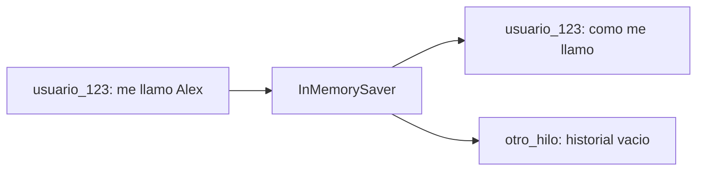

# Lección 03 — Memoria: `checkpointer` + `thread_id`

El historial de mensajes ya existía en la lección 02. Aquí aprendemos a
conservarlo entre varias llamadas a `graph.invoke()`.

```bash
python langgraph/avanzado/03_memoria.py
```

Hace falta `OPENROUTER_API_KEY`. La demo hace tres llamadas consecutivas y
espera entre ellas para no lanzar una ráfaga contra el proveedor.

## El `State` no es la memoria

El `State` describe qué datos necesita un turno:

```python
class State(TypedDict):
    messages: Annotated[list[AnyMessage], add_messages]
```

Si compilamos el grafo sin checkpointer, cada `invoke()` recibe solo la
entrada que le pasamos. El tipo `State` no guarda nada por sí mismo.

La memoria aparece al compilar:

```python
graph = builder.compile(checkpointer=InMemorySaver())
```

`InMemorySaver` guarda versiones del estado en RAM. LangGraph carga el estado
anterior, ejecuta el grafo y guarda el nuevo estado asociado a un identificador
de conversación.

## `thread_id` separa conversaciones

La configuración se pasa en `configurable`:

```python
mismo_hilo = {"configurable": {"thread_id": "usuario_123"}}
otro_hilo = {"configurable": {"thread_id": "otro_hilo"}}
```

El mismo `thread_id` significa “esta conversación”. Otro `thread_id` significa
un historial independiente.



No es el nombre del usuario ni una clave secreta. Es una clave lógica para
localizar el estado de un hilo.

## Los tres turnos de la demo

1. `usuario_123` dice: **“Hola, me llamo Alex”**. El estado se guarda.
2. `usuario_123` pregunta: **“¿Cómo me llamo?”**. El modelo recibe el saludo
   anterior y puede contestar Alex.
3. `otro_hilo` pregunta lo mismo. Ese hilo no contiene el saludo y empieza
   vacío.

La diferencia importante es la configuración, no el `State` declarado en
Python:

```python
r1 = graph.invoke({"messages": [HumanMessage("Hola, me llamo Alex")]}, mismo_hilo)
r2 = graph.invoke({"messages": [HumanMessage("¿Cómo me llamo?")]}, mismo_hilo)
r3 = graph.invoke({"messages": [HumanMessage("¿Cómo me llamo?")]}, otro_hilo)
```

## Qué significa “memoria” aquí

Esta demo conserva el historial completo de mensajes del hilo. No resume,
busca recuerdos semánticos ni crea una base de datos de conocimiento.

También es una memoria temporal: `InMemorySaver` vive en el proceso. Si cierras
el programa, la información desaparece. En un sistema real se usaría un
checkpointer persistente, por ejemplo Postgres, con políticas de retención,
aislamiento y limpieza definidas explícitamente.

## Una confusión frecuente

El `thread_id` no se mete dentro del mensaje del usuario. Va en la
configuración de ejecución porque identifica el contexto que LangGraph debe
cargar antes de ejecutar el grafo.

Esto permite que la misma función `chatbot` sea reutilizada para muchos
usuarios: cambia la configuración, no el código del nodo.

## Qué usa y qué no usa

| Usa | No usa |
|---|---|
| `InMemorySaver` | Tools |
| `RunnableConfig` | Tavily |
| `thread_id` | OpenTUI |
| `add_messages` | Persistencia tras cerrar el proceso |
| OpenRouter | Recuperación semántica o RAG |

## Mapa de ficheros

| Fichero | Papel |
|---|---|
| [`langgraph/avanzado/03_memoria.py`](../../langgraph/avanzado/03_memoria.py) | Tres llamadas y dos hilos |
| [`langgraph/avanzado/02_tools.py`](../../langgraph/avanzado/02_tools.py) | Punto de comparación sin memoria |
| [`langgraph/avanzado/04_chatbot.py`](../../langgraph/avanzado/04_chatbot.py) | Arranca la TUI del chatbot completo |
| [`app/graph.py`](../../app/graph.py) | Compila el grafo con `InMemorySaver` |

En 04, la memoria convive con campos de control del turno. El documento
[`04_juez_validador.md`](04_juez_validador.md) explica cómo se reinicia
`intentos` al comenzar una pregunta nueva para que el límite de reintentos no
se arrastre al turno siguiente.
