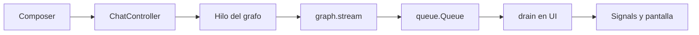

# TUI e interfaz

`app/graph.py` define el grafo. [`ui/chat_tui.py`](../../ui/chat_tui.py)
se encarga de mostrarlo y recoger texto del usuario. Separar ambas capas
permite cambiar la interfaz sin cambiar juez, tools o validador.

## La TUI no ejecuta el grafo en el hilo de la pantalla

OpenTUI necesita que sus señales y componentes se actualicen desde su hilo
principal. Las llamadas al modelo y a Tavily pueden tardar, así que
`ChatController` hace lo siguiente:



Cuando el usuario pulsa Enter, `submit()` limpia el texto, añade una fila
`human`, marca la interfaz como ocupada y lanza un `threading.Thread`.
`_run_turn()` consume:

```python
stream_mode=["tasks", "messages", "updates"]
```

El hilo de trabajo nunca toca directamente los `Signal` de OpenTUI. Encola
funciones en `queue.Queue`; `drain()` las ejecuta en el ciclo de pintado.
Cuando termina, el composer vuelve a estar disponible.

## De un evento a una fila

[`ui/chat_lines.py`](../../ui/chat_lines.py) es un parser puro. No
conoce terminales, colas ni OpenRouter. Convierte mensajes y updates en
`ChatLine(kind, text, key)`.

| Entrada | Salida visible |
|---|---|
| `HumanMessage` | `tú` |
| razonamiento de `AIMessage` | `pensar` |
| `AIMessage.tool_calls` | `tool` con nombre y argumentos |
| `ToolMessage` | `dato` |
| texto de `AIMessage` | `bot` |
| update de `juez` | `juez: web · query` |
| update de `validador` | `validador: ok/reintenta · motivo` |

Los nodos `juez` y `validador` no añaden mensajes de chat falsos. Devuelven
campos del `State`; el parser los convierte en trazas visuales.

`lineas_del_turno()` recorre el historial desde el último `HumanMessage` hacia
atrás, así que una nueva pregunta no vuelve a pintar como si fuera actual todo
lo ocurrido en turnos anteriores.

## El sidebar del grafo

`GrafoEstado` conserva una versión visual del estado:

- `judging`: el juez decide;
- `thinking` / `writing`: el modelo está procesando o redactando;
- `tools`: hay herramientas activas;
- `validating`: el validador comprueba el borrador;
- `retrying`: se inicia otra vuelta;
- `idle`: no hay turno en curso.

`aplicar_evento()` actualiza esa máquina visual a partir de `tasks`,
`messages` y `updates`. El sidebar puede iluminar `juez`, `LLM`, `tools` o
`validador` sin tener que inferirlo desde el texto del chat.

La pantalla tiene además:

- cabecera con modelo, hilo y número de turno;
- recorrido `START` → nodos → `END`;
- leyenda de la fase actual;
- globos de usuario y bot;
- trazas separadas de tools, datos, juez y validador;
- composer con foco real.

El contenido de Tavily se limpia para la pantalla: el modelo recibe URLs y
snippets, pero el globo de `dato` no vuelca URLs largas ni ruido de snippets.

## Composer y teclado

[`ui/chat_input.py`](../../ui/chat_input.py) contiene la parte pura
del editor:

- `HistorialComposer.push()` guarda envíos no vacíos;
- evita duplicados consecutivos;
- limita el historial;
- `anterior()` navega hacia mensajes antiguos;
- `siguiente()` vuelve al presente y restaura el borrador;
- `indice_cursor()` calcula línea y columna para el caret.

En la interfaz:

| Tecla | Acción |
|---|---|
| `Enter` | Enviar el mensaje |
| `Shift+Enter` | Insertar otra línea |
| `↑` / `↓` | Navegar por el historial |
| `Esc` | Cerrar la TUI |
| `salir`, `q`, `exit` | Cerrar al enviar |

Mientras el grafo está ocupado, Enter no lanza otro turno. Esto evita
concurrencia accidental dentro del mismo `thread_id`.

## `app/` y `ui/`

El agente vive en `app/`. La presentación vive en `ui/`.

| Módulo | Responsabilidad |
|---|---|
| [`app/fecha_hoy.py`](../../app/fecha_hoy.py) | Fecha en español, tool de calendario y consigna del chatbot |
| [`app/buscar_web.py`](../../app/buscar_web.py) | Tool Tavily, query fechada y formato corto de resultados |
| [`app/juez.py`](../../app/juez.py) | Dataclass, parseo de `usar_web` y rutas del juez |
| [`app/validador.py`](../../app/validador.py) | Heurística, parseo de `ok` y límite de reintentos |
| [`ui/chat_input.py`](../../ui/chat_input.py) | Estado puro del composer |
| [`ui/chat_lines.py`](../../ui/chat_lines.py) | Mensajes y updates a filas |
| [`ui/chat_tui.py`](../../ui/chat_tui.py) | Render, teclado y puente hilo/UI |
| [`ui/consola.py`](../../ui/consola.py) | Banners, paneles, ASCII y spinner de 01–03 |

La regla de diseño es que los parseadores y helpers pequeños no necesitan
arrancar una TUI ni llamar a internet para poder probarse.

## Mapa de ficheros

| Fichero | Se lee junto con |
|---|---|
| [`app/graph.py`](../../app/graph.py) | [`04_juez_validador.md`](04_juez_validador.md) |
| [`langgraph/04_chatbot.py`](../../langgraph/04_chatbot.py) | Arranca `run_tui` |
| [`ui/chat_tui.py`](../../ui/chat_tui.py) | [`tests/test_chat_tui.py`](../../tests/test_chat_tui.py) |
| [`ui/chat_lines.py`](../../ui/chat_lines.py) | [`tests/test_chat_lines.py`](../../tests/test_chat_lines.py) |
| [`ui/chat_input.py`](../../ui/chat_input.py) | [`tests/test_chat_input.py`](../../tests/test_chat_input.py) |
| [`ui/consola.py`](../../ui/consola.py) | [`tests/test_consola.py`](../../tests/test_consola.py) |

La TUI necesita una terminal interactiva: si stdin o stdout no son TTY,
`run_tui()` termina con un mensaje explicativo. Para probar su layout no hace
falta una terminal real; `test_render` pinta en un buffer, como se explica en
[`../tests.md`](../tests.md).
