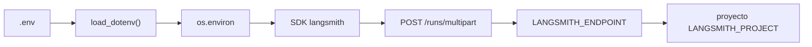

# Cómo se conecta LangSmith

LangSmith no abre un socket permanente. El proceso Python lee cuatro variables
del `.env`, y el SDK envía cada traza por HTTP a la API de esa región. Si la
región no coincide con la cuenta, la clave parece válida y la API responde
`403 Forbidden`.

Este documento explica esa conexión. El recorrido de la clase (scripts 01–04,
árbol, tags, scores) está en
[`observabilidad.md`](observabilidad.md).

## Qué tiene que existir

Copia [`.env.example`](../../.env.example) a `.env` y rellena las claves.
No pegues valores en el chat, en Git ni en las trazas.

| Variable | Papel |
|---|---|
| `LANGSMITH_TRACING` | Interruptor. `true` activa el auto-tracer de LangChain / LangGraph |
| `LANGSMITH_API_KEY` | Autenticación (`lsv2_pt_…` personal o `lsv2_sk_…` de servicio) |
| `LANGSMITH_PROJECT` | Nombre del proyecto en la UI. Aquí: `thepower-clase-2` |
| `LANGSMITH_ENDPOINT` | Host de la API. Tiene que ser el de **la región de la cuenta** |

Nombres antiguos (`LANGCHAIN_TRACING_V2`, `LANGCHAIN_API_KEY`,
`LANGCHAIN_PROJECT`) no se usan.

Una clave ligada a varios workspaces puede necesitar también
`LANGSMITH_WORKSPACE_ID`. Un token personal de un solo workspace no.

## De `.env` a la API



1. `app/graph.py` llama a `load_dotenv()`. Cualquier script que importe el
   grafo (TUI de Clase 1 incluida) carga el `.env` de la raíz.
2. Si `LANGSMITH_TRACING=true` y hay `LANGSMITH_API_KEY`, LangGraph emite
   spans al ejecutar `invoke()` o `stream()`. No hace falta un callback extra.
3. El SDK hace `POST {LANGSMITH_ENDPOINT}/runs/multipart` con la clave en
   `x-api-key`.
4. LangSmith agrupa esos spans en el proyecto `LANGSMITH_PROJECT`. Si el
   proyecto no existe, suele crearse en el primer envío.

Los scripts de Clase 2 no se fían solo de eso. `activar_langsmith()` en
[`observability/_comun.py`](../../observability/_comun.py) fuerza
`LANGSMITH_TRACING=true`, pone el proyecto por defecto y exige la clave
sin imprimirla. `01_sin_obs.py` hace lo contrario: `desactivar_langsmith()`
deja `LANGSMITH_TRACING=false` para el control experimental.

## La región es parte de la autenticación

La clave vive en **una** región. El endpoint por defecto de mucha
documentación es US. Una cuenta creada en Europa tiene que apuntar a EU.

| Región de la cuenta | `LANGSMITH_ENDPOINT` |
|---|---|
| US (por defecto en muchos tutoriales) | `https://api.smith.langchain.com` |
| EU | `https://eu.api.smith.langchain.com` |

La UI de LangSmith muestra la región al crear la cuenta o en ajustes. Este
repo usa EU: thePower está en Europa y Langfuse de la misma clase también
apunta a `https://cloud.langfuse.com`.

Un chequeo barato, sin imprimir la clave:

```text
GET {LANGSMITH_ENDPOINT}/sessions?limit=1
cabecera x-api-key: <LANGSMITH_API_KEY>
```

| Resultado | Significado |
|---|---|
| `200` | La clave es de esa región. La conexión de lectura funciona |
| `403 Forbidden` | Clave de otra región, revocada, o sin permiso de workspace |
| `401` | Clave vacía, cortada o mal copiada |

`GET /info` responde `200` **sin** autenticar: solo dice que el host está
arriba. No sirve para validar la clave.

El fallo típico de este repo fue:

```text
Failed to POST https://api.smith.langchain.com/runs/multipart
{"error":"Forbidden"}
```

`/sessions` daba `403` en US y `200` en EU. La clave no estaba mal: el
host sí. Después de cambiar `LANGSMITH_ENDPOINT`, hay que **reiniciar** el
proceso (`python langgraph/avanzado/04_chatbot.py` o el script de observabilidad).
`load_dotenv()` no recarga un proceso que ya está en marcha.

## Qué viaja en cada traza

Además del árbol de nodos, `config_base()` añade contexto de aula:

- `thread_id`: el hilo de Clase 1 más un sufijo (`usuario_123-c2-02`) para
  no mezclar lecciones.
- `tags`: por ejemplo `clase-2`, `langsmith`, `thepower`.
- `metadata.user_id`: `sha256("alumno-demo-thepower")` recortado a 16 hex.
  Nunca un email, DNI o teléfono.

En la UI del proyecto `thepower-clase-2` el árbol se parece a:

```text
juez
└── chatbot
    └── tools
        └── chatbot
            └── validador
```

La ruta real depende del juez y del validador. Los tags y el `thread_id`
sirven para filtrar.

`02_langsmith.py` también intenta `Client().pull_prompt("thepower-obs:staging")`.
Eso es otra llamada a la misma API (Prompt Hub). Si el prompt no existe, la
demo lo dice y sigue: no se inyecta en el grafo.

## Cómo comprobarlo en clase

1. `.env` tiene las cuatro variables. `LANGSMITH_ENDPOINT` es el de tu
   región (en este repo, EU).
2. `python observability/01_sin_obs.py` funciona. Si falla, el bug es el
   grafo, no LangSmith.
3. `python observability/02_langsmith.py` termina sin `Forbidden`.
4. En [smith.langchain.com](https://smith.langchain.com) (o la UI EU de tu
   cuenta) abre el proyecto `thepower-clase-2` y busca el árbol.

La TUI de Clase 1 (`python langgraph/avanzado/04_chatbot.py`) también traza si
`LANGSMITH_TRACING=true` en el `.env`, porque `app/graph.py` carga esas
variables. El script aislado `langgraph-agent/agent.py` las apaga a
propósito: no forma parte de la clase.

## Si sigue fallando

| Síntoma | Qué mirar |
|---|---|
| `Falta LANGSMITH_API_KEY en .env` | La variable está vacía. `activar_langsmith()` sale aquí |
| `403` / `Forbidden` en `/runs/multipart` | Región incorrecta, o clave sin permiso de escritura |
| `401` | Clave incompleta (un `lsv2_pt_` de aula tiene ~51 caracteres) |
| TUI con error y script 02 bien | El proceso de la TUI arrancó antes de cambiar el `.env` |
| 02 bien y la UI vacía | Proyecto distinto, o estás mirando la región US |
| 01 falla | No es LangSmith: vuelve al grafo de Clase 1 |

No imprimas la clave para depurar. Basta el prefijo (`lsv2_pt_` /
`lsv2_sk_`), la longitud y el código HTTP.
