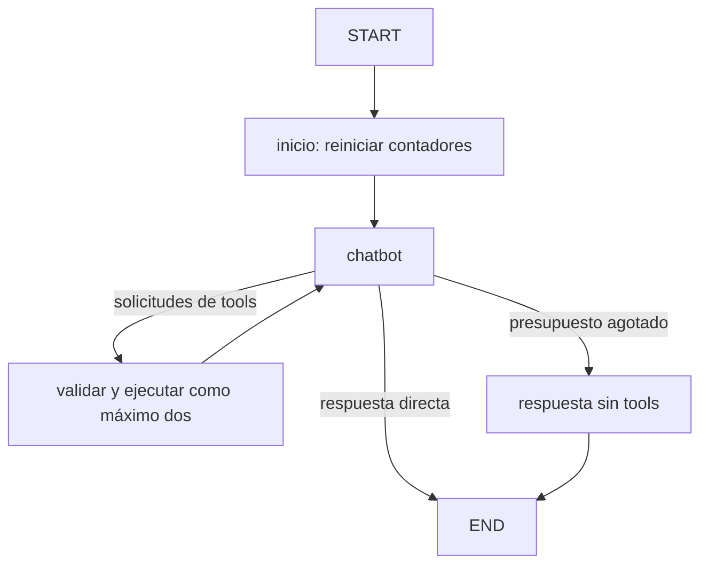

# Solución de referencia · S5 / S6

## Arquitectura

`app/soporte` contiene el único agente de soporte de ambas clases. `graph.py` recibe modelo, prompt y checkpointer; `tools.py` lee datos ficticios; `persistence.py` mantiene el ciclo de vida de SQLite. `runner.py` añade la observabilidad en el borde y devuelve evidencia por consulta.

`respuesta_final` es un modo del nodo chatbot, no otro nodo registrado. La ruta de consola lo distingue para explicar el presupuesto. El historial se añade mediante `add_messages`; contadores, errores, llamadas y métricas se reinician en `inicio`.

### Herramientas y errores

Cada solicitud tiene su ToolMessage, incluso si es inválida, desconocida o bloqueada. Los dos primeros intentos consumen presupuesto; los siguientes no ejecutan funciones. Una respuesta final que insista en tools recibe mensajes de rechazo y un cierre local. Así no quedan solicitudes huérfanas ni un bucle de modelo indefinido.

Si falla el proveedor se conserva una explicación controlada y el tipo de error, sin volcar el cuerpo HTTP. Los timeouts del adaptador están en **milisegundos**. El SDK se inyecta con reintentos desactivados para que no oculte una espera de varios minutos.

### Memoria

`SqliteSaver` se abre antes de compilar/invocar y se cierra al terminar. El fichero persiste entre procesos. Un nuevo hilo empieza sin historial y cada evaluación usa un hilo nuevo. Nunca borrar una BD compartida como forma automática de resetear una demo.

## Prompts y evaluación

- `v1` y `v2` son textos locales congelados. No se cambiaron para corregir los resultados del test.
- El manifiesto privado registra hash, commit LangSmith y versión Langfuse. La recuperación compara hashes antes de ejecutar.
- En `both` se recuperan ambas copias, se verifica igualdad y se vinculan sus identidades al mismo recorrido. No se generan dos respuestas distintas para instrumentar dos plataformas.
- Los diez casos reservados tienen resultado esperado y tools esperadas; la rúbrica se escribió antes del lote.
- La valoración de calidad es manual sobre las respuestas guardadas. `answer_present` no es una métrica semántica.
- Los resultados incluyen identificadores, fecha, modelo, tokens, coste del proveedor y posibles errores; `null` significa ausente o no valorado.

## Privacidad

`privacy.redact` recorre diccionarios, listas y mensajes Pydantic antes de serializarlos. El primer ensayo detectó que copiar un mensaje como objeto sin recorrerlo dejaba sus campos intactos; hay un test de regresión específico.

LangSmith usa funciones de ocultación/transformación con un cliente propio. Langfuse utiliza el hook de exportación de spans para filtrar también la instrumentación anidada. Se comprueban ambas plataformas con datos sintéticos. El filtro es didáctico y limitado: no afirma detectar toda PII. La BD local y el modelo pueden recibir el texto original; son fronteras separadas.

El contexto `enabled=False` desactiva también la persistencia del tracer explícito de LangSmith. Por eso se habilita únicamente cuando se pide LangSmith y se conserva un único callback por plataforma. Los tests y la lectura remota verifican que el modo off no exporta y que los nodos de modelo no se duplican.

## Qué explica el alumno

S5: estado versus persistencia, herramientas versus texto generado, aislamiento de hilos y presupuesto. S6: ejecución versus recepción remota, prompt local versus remoto, métricas versus calidad, dato ausente versus cero y filtrado de telemetría versus envío al modelo.

## Solución avanzada

El grafo con juez/validador está en `app/graph.py` y la TUI se abre con `langgraph/avanzado/04_chatbot.py`. Sus ejemplos antiguos siguen disponibles. Los scripts de observabilidad originales se conservan como referencia histórica de código en `observabilidad-avanzada-original/`; no son puntos de entrada ejecutables desde esa carpeta. El recorrido recomendado para S6 es el de `observability/` en la raíz.

## Coste del proveedor frente a estimación del panel

En el ensayo, Langfuse infería un coste distinto al devuelto por OpenRouter. No se modificaron tarifas globales de la cuenta. La evidencia conserva el importe del proveedor y lo registra como score `provider_cost_usd` en las dos plataformas. La cifra automática del panel no se presenta como factura; se explica esta diferencia en clase.
